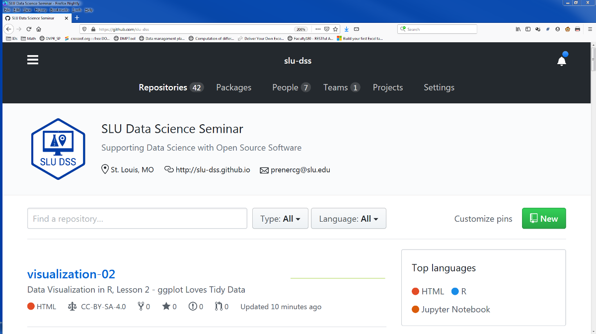

# What We're All About

We're in our **eigth semester** of offering seminars on using `R` for data science. 

</br>

We were founded in **2015** by Christy Garcia, Chris Prener, and Kelly Lovejoy.

</br>

We are a **collaborative, interdisciplinary** group at Saint Louis University focused on **building community** around open source software and open science.

---

# What We're All About

We `r emojifont::emoji('heart')` `R`, RStudio, and the `tidyverse`!

--

</br>

Our seminars cover *most* of data science workflow from Wickham and Grollman (2016):

```{r add-workflow-image, echo=FALSE}
knitr::include_graphics("assets/workflow.png")
```

---

# Upcoming Events

### DSS 08: Data Visualization in `R`

* Session 03 - October 2nd
* Session 04 - October 16th

--

### Other DSS Events

* Brownbag, Open Science Framework - October 10th

---

# GitHub

We host all of our materials on GitHub. If you want to get back to the lesson materials later, head to [https://github.com/slu-dss](https://github.com/slu-dss) and look for the `visualization-02` repository (a special type of folder).

```{r add-github-image, echo=FALSE}

```

---

# Getting Started

* You need to have `R` installed and **RStudio** open.

* You need to have installed all of the necessary packages:

```r
install.packages(
c("tidyverse", "here", "knitr", "rmarkdown", "usethis"))
```

* You need to have downloaded and opened our lesson materials:

```r
usethis::use_course(
"https://github.com/slu-dss/visualization-02/archive/master.zip")
```

* RStudio should open a new window that says `visualization-02` in the upper right hand corner.
