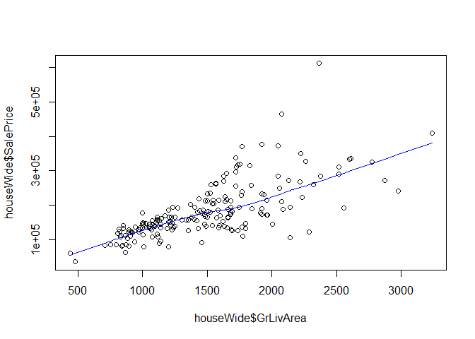

Visualization 02 - ggplot loves tidy data - Completed Version
================
Yujie Su, M.S. & Matthew Schuelke, Ph.D.
(September 18, 2019)

## Introduction

In this lesson, we will explore how the structure of data influences
visualizations, and how to transform data into a tidy format.

## Load Dependencies

The following code loads the package dependencies for our
    analysis:

``` r
library(here)  # find your files
```

    ## Warning: package 'here' was built under R version 3.6.1

    ## here() starts at C:/Users/schuelkem/OneDrive - Saint Louis University/Data Science Seminar/repos/visualization-02

``` r
library(readr) # work with csv files
```

Now you try loading two additional packages - `ggplot2` (for making
visualizations) and `tidyr` (for data wrangling):

``` r
library(ggplot2) # data plotting
library(tidyr)   # data wrangling
```

We now have the packages needed for our analyses.

## Load Data

``` r
houseWide <- read_csv(here('data', 'houseWide.csv'))
```

    ## Parsed with column specification:
    ## cols(
    ##   Id = col_double(),
    ##   Year = col_double(),
    ##   Ages = col_character(),
    ##   Style = col_character(),
    ##   LotArea = col_double(),
    ##   GrLivArea = col_double(),
    ##   SalePrice = col_double()
    ## )

Now you try to load data ‘houseWide2.csv’

``` r
houseWide2 <- read_csv(here('data', 'houseWide2.csv'))
```

    ## Parsed with column specification:
    ## cols(
    ##   Id = col_double(),
    ##   SalePrice = col_double(),
    ##   Foundation = col_character(),
    ##   RoofStyle = col_character(),
    ##   FFlrSF = col_double(),
    ##   SFlrSF = col_double(),
    ##   TotalBsmtSF = col_double(),
    ##   YearBuilt = col_double(),
    ##   Ages = col_character()
    ## )

## Objects and Layers

In this section, we will explore how the structure of data influences
visualizations. Before plotting, we need to understand our data a little
bit.

### Data Layer

To understand how the data structure relates to plotting, let’s look at
the `houseWide` data set.

``` r
print(houseWide)
```

    ## # A tibble: 190 x 7
    ##       Id  Year Ages  Style    LotArea GrLivArea SalePrice
    ##    <dbl> <dbl> <chr> <chr>      <dbl>     <dbl>     <dbl>
    ##  1     1  2004 Young OneStory    3182      1269    192000
    ##  2     2  1998 Young OneStory   10140      1680    213250
    ##  3     3  1950 Old   OneStory    9600      1067    128000
    ##  4     4  1992 Young TwoStory   10186      1923    190000
    ##  5     5  2006 Young TwoStory   15611      1919    233230
    ##  6     6  2005 Young OneStory    6955      1368    202500
    ##  7     7  1955 Old   Other       9600      1661    165500
    ##  8     8  1977 Young TwoStory   12227      2872    272000
    ##  9     9  1949 Old   TwoStory    6270      2002    145000
    ## 10    10  2009 Young TwoStory    3951      1224    164500
    ## # ... with 180 more rows

For the data set, each column is a variable, and we have 7 variables in
the `houseWide` data set.

*First we will explore the difference between quick base plots and quick
ggplot plots.*

## Base plot

We could call the `base` package `plot` function by positional arraying
the x and y variables as the `plot()` function arguments to make a
scatter plot of `SalePrice` against
`GrlivArea`.

``` r
plot(houseWide$GrLivArea, houseWide$SalePrice)
```

<!-- -->

If we want to add a fit line describing the relationship between
`GrLivArea` and `SalePrice` we can use `lines()` in conjunction with
`lowess()` and color it blue.

``` r
plot(houseWide$GrLivArea, houseWide$SalePrice)
lines(lowess(houseWide$GrLivArea, houseWide$SalePrice), col = "blue")
```

<!-- -->

Limitations of base plot:

1.  Plot doesn’t get redrawn.

2.  Plot is drawn as an image, and we keep adding on that image.

3.  Need to manually add legend.

4.  No unified framework for plotting.

## ggplot2

The central function in `ggplot2` is `ggplot()`. You will use it on all
variety of plots we make.

What we have here are two layers of `ggplot2`: data and aesthetics. Data
is our data set, `houseWide`, and we will use the same aesthetics that
we used in base plot, Y is `SalePrice` plotted against X, `GrlivArea`.

To specify the `geom_point` layer, we can add a plus at the end of first
argument, then add a `geom_point()` function. No argument is needed
right now.

This is same as the first plot we created with base package.

``` r
ggplot(houseWide, aes(x = GrLivArea, y = SalePrice)) + 
  geom_point()
```

<!-- -->

### ggplot Objects

A major difference between `ggplot` and base plot is that `ggplot`
creates an object that can be saved and manipulated.

We could assign the basic layers to an object called `p`, for example.
We can recycle the object with a variety of different plot types.

First we make the common, underlying object.

``` r
p <- ggplot(houseWide, aes(x = GrLivArea, y = SalePrice))
```

Then we can add layer to that object such as
`geom_points()`.

``` r
p + geom_point()
```

<!-- -->

Or we could instead add a
`geom_smooth()`.

``` r
p + geom_smooth()
```

    ## `geom_smooth()` using method = 'loess' and formula 'y ~ x'

<!-- -->

We can assign multiple layers for an object, and then when I call p, the
data, the aesthetic and the geom which define the plot type is drawn.

``` r
p <- ggplot(houseWide, aes(x = GrLivArea, y = SalePrice)) + 
  geom_point() +
  geom_smooth()

p
```

    ## `geom_smooth()` using method = 'loess' and formula 'y ~ x'

<!-- -->

By now you should see that ggplot is a very flexible way of making
complex plots.

Now it’s your turn to make a plot.

First print out the contents of `houseWide2` to see its structure.

``` r
print(houseWide2)
```

    ## # A tibble: 200 x 9
    ##       Id SalePrice Foundation RoofStyle FFlrSF SFlrSF TotalBsmtSF YearBuilt
    ##    <dbl>     <dbl> <chr>      <chr>      <dbl>  <dbl>       <dbl>     <dbl>
    ##  1     1    160000 BrkTil     Gable        976    332         728      1940
    ##  2     2    215000 PConc      Gable       1065    846         777      1993
    ##  3     3     81000 PConc      Gambrel      658    526         658      1910
    ##  4     4    197000 CBlock     Hip         1040    685         539      1979
    ##  5     5    176000 CBlock     Gable       1098    880         832      1968
    ##  6     6    225000 CBlock     Gable       1122   1121         700      1990
    ##  7     7    148500 CBlock     Gable        855    601         855      1976
    ##  8     8    148500 CBlock     Gable        855    586         855      1978
    ##  9     9    200000 CBlock     Gable       1338   1296        1248      1969
    ## 10    10    189950 BrkTil     Gable        912    514         912      1918
    ## # ... with 190 more rows, and 1 more variable: Ages <chr>

Then make a scatter plot of `SalePrice` against first floor square feet
(`FFlrSF`), and add a fitted loess line on it.

``` r
ggplot(houseWide2, aes(x = FFlrSF, y = SalePrice)) + 
  geom_point() + 
  geom_smooth()
```

    ## `geom_smooth()` using method = 'loess' and formula 'y ~ x'

<!-- -->

## Proper Data Format

In a previous section we plotted a scatter plot of `SalePrice` against
`GrLivArea`. If we want to visualize the relationship between `LotArea`
and `SalePrice`. We could make a different scatter plot.

``` r
ggplot(houseWide, aes(x = LotArea, y = SalePrice)) + 
  geom_point() + 
  geom_smooth()
```

    ## `geom_smooth()` using method = 'loess' and formula 'y ~ x'

<!-- -->

Now, you try to make 2 scatter plots with loess fit lines:

1.  `SalePrice` against the area of second floor (`SFlrSF`).

<!-- end list -->

``` r
ggplot(houseWide2, aes(x = SFlrSF, y = SalePrice)) + 
  geom_point() + 
  geom_smooth()
```

    ## `geom_smooth()` using method = 'loess' and formula 'y ~ x'

<!-- -->

2.  `SalePrice` against the total basement area (`TotalBsmtSF`).

<!-- end list -->

``` r
ggplot(houseWide2, aes(x = TotalBsmtSF, y = SalePrice)) + 
  geom_point() + 
  geom_smooth()
```

    ## `geom_smooth()` using method = 'loess' and formula 'y ~ x'

<!-- -->

In our previous plots, various area variables were mapped to the x
aesthetic, so area is very interesting.

What if we want to plot `LotArea` and `GrLivArea` at the same time, and
make comparison between them?

One method is to add another points geometry layer on the other using
“+”:

``` r
ggplot(houseWide, aes(x = GrLivArea, y = SalePrice)) + 
  geom_point() + 
  geom_point(aes(x = LotArea, y = SalePrice), col = "red")
```

<!-- -->

Compared with the base R plot,

1.  `ggplot` specifies a new x and y axis when we add a layer on top of
    the previous plot

2.  Plotting space is adjusted for the new information

3.  `ggplot2` produces an object that we can manipulate

Although this works, this is not a correct way to do ggplot plots. One
reason this is wrong is because there is no legend for the second group
of data.

**So, please never do this.**

## Data Structure

To correctly plot the data set at hand, we need to think about the
structure of the data set first.

In previous plots, the y variables are the same, and x variables are for
various areas. In one specific instance, we plotted 3 variables,
`SalesPrice`, `LotArea` and `GrlivArea`. In both `base` package and
`ggplot2`, we layered 2 series of points on top of each other. If we
wanted to do it properly, we would rearrange the data to define
variables in our data set according to our actual interests.

Since both `GrLivArea` and `LotArea` are different types of area, we
want to gather the value of `LotArea` and `GrlivArea` into one column.
We can do this with package `tidyr`.

In package `tidyr`, the function `gather` is used to gather columns into
rows. Its compliment, the function `spread` is used to spread rows into
columns.

Here we gather the value of `LotArea` and `GrLivArea` into one column
‘Area’, and add another column ‘Type’ indicating the type of
area.

``` r
houseTidy <- tidyr::gather(data = houseWide, key = "Type", value = 'Area', LotArea, GrLivArea)
```

Let’s have a look at the structure of our new data.

Now, both `LotArea` and `GrlivArea` are categories within the new `Type`
variable.

``` r
print(houseTidy)
```

    ## # A tibble: 380 x 7
    ##       Id  Year Ages  Style    SalePrice Type     Area
    ##    <dbl> <dbl> <chr> <chr>        <dbl> <chr>   <dbl>
    ##  1     1  2004 Young OneStory    192000 LotArea  3182
    ##  2     2  1998 Young OneStory    213250 LotArea 10140
    ##  3     3  1950 Old   OneStory    128000 LotArea  9600
    ##  4     4  1992 Young TwoStory    190000 LotArea 10186
    ##  5     5  2006 Young TwoStory    233230 LotArea 15611
    ##  6     6  2005 Young OneStory    202500 LotArea  6955
    ##  7     7  1955 Old   Other       165500 LotArea  9600
    ##  8     8  1977 Young TwoStory    272000 LotArea 12227
    ##  9     9  1949 Old   TwoStory    145000 LotArea  6270
    ## 10    10  2009 Young TwoStory    164500 LotArea  3951
    ## # ... with 370 more rows

Now you try to gather the value of columns `FFlrSF`, `SFlrSF`, and
`TotalBsmtSF` into one column ‘Area’, and add a new column ‘Floor’
indicating the floor of the house. The new ‘Floor’ variable will be a
categorical variable with values of “FFlrSF”“,”SFlrSF“,
and”TotalBsmtSF". Store this new dataset under a different
name.

``` r
houseTidy2 <- gather(data = houseWide2, key = "Floor", value = "Area", FFlrSF, SFlrSF, TotalBsmtSF)
```

After you finished the transformation, have a look at the structure of
your new data set use `print()`.

``` r
print(houseTidy2)
```

    ## # A tibble: 600 x 8
    ##       Id SalePrice Foundation RoofStyle YearBuilt Ages  Floor   Area
    ##    <dbl>     <dbl> <chr>      <chr>         <dbl> <chr> <chr>  <dbl>
    ##  1     1    160000 BrkTil     Gable          1940 Old   FFlrSF   976
    ##  2     2    215000 PConc      Gable          1993 Young FFlrSF  1065
    ##  3     3     81000 PConc      Gambrel        1910 Old   FFlrSF   658
    ##  4     4    197000 CBlock     Hip            1979 Young FFlrSF  1040
    ##  5     5    176000 CBlock     Gable          1968 Old   FFlrSF  1098
    ##  6     6    225000 CBlock     Gable          1990 Young FFlrSF  1122
    ##  7     7    148500 CBlock     Gable          1976 Old   FFlrSF   855
    ##  8     8    148500 CBlock     Gable          1978 Young FFlrSF   855
    ##  9     9    200000 CBlock     Gable          1969 Old   FFlrSF  1338
    ## 10    10    189950 BrkTil     Gable          1918 Old   FFlrSF   912
    ## # ... with 590 more rows

Here we make scatter plot of `SalePrice` against `GrlivArea` and
`LotArea` at once with our new data set.

``` r
ggplot(houseTidy, aes(x = Area, y = SalePrice, color = Type)) + 
  geom_point()
```

<!-- -->

In previous plots, we used a different color to distinguish area types,
so color is a scale, like the X axis and Y axis are scales.

Above is the typical way in which we use ggplot, the data is arranged to
make the function calls as straightforward as possible.

We have 3 variables and we map them in 3 scales. Now a legend is
automatically generated.

It’s your turn to make scatter plot of `SalePrice` against different
`Style`s at the same time with your new data set. Try to map `Area` to
the X axis, `SalePrice` to the Y axis, and `Style` to color.

``` r
ggplot(houseTidy2, aes(x = Area, y = SalePrice, color = Floor)) + 
  geom_point()
```

<!-- -->

We now have a variable `Style`, which has ‘1Story’, ‘2Story’ and ‘Other’
as categories. We have a variable `Type`, which has ‘GrLivArea’ and
‘LotArea’ as categories. We can make one plot for each `Style` and
`Type` interaction investigated. We can do this by mapping one variable
to the color scale and use the other variable for what is known as
*faceting*.

The proper way to make plots is not only easier, but a more accurate
representation of the data.

``` r
ggplot(houseTidy, aes(x = Area, y = SalePrice, col = Type)) + 
  geom_point() + 
  facet_grid(. ~ Style)
```

<!-- -->

Here you try to make a scatter plot of `SalePrice` against `Area`, and
compare the impacts of variables `Ages` and `Floor` at the same time
using the color scale and faceting.

``` r
ggplot(houseTidy2, aes(x = Area, y = SalePrice, col = Floor)) + 
  geom_point() + 
  facet_grid(. ~ Ages)
```

<!-- -->
